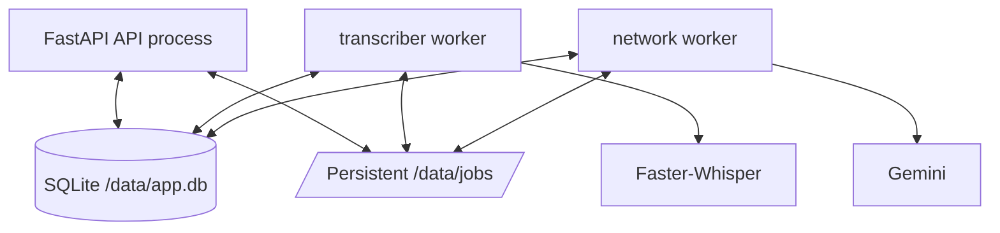

# Persian Auto Transcriber Backend

This document describes the backend architecture, processing model, persistence, cleanup-integrity system, APIs, and operational behavior of Persian STT.

## 1. Purpose

The backend turns uploaded audio into persistent Persian transcript artifacts while keeping CPU inference, network cleanup, API serving, and recovery responsibilities separated.

Its main goals are:

1. handle long audio without requiring one uninterrupted process lifetime;
2. keep original audio and intermediate work durable;
3. preserve deterministic subtitle timing;
4. make Gemini cleanup optional and recoverable;
5. never silently publish a cleaned transcript that has lost a substantial section;
6. expose enough state for a responsive browser UI without putting heavy processing in the API process.

## 2. Technology stack

- **Python 3.13**
- **FastAPI** + Uvicorn
- **SQLAlchemy 2**
- **SQLite** for coordination/state
- **Faster-Whisper** / CTranslate2 for local ASR
- **Hazm** for Persian normalization
- **Google GenAI SDK** for optional Gemini cleanup
- **httpx SOCKS support** for network routing
- **FFmpeg / FFprobe** for validation, metadata, and transcription windows
- **psutil** for system resource reporting
- **cryptography** for encrypted external API credentials

## 3. Process architecture



The API does not run Whisper inference. Work is represented as persistent `Task` rows and claimed by workers by queue.

### Standard queues

| Queue | Worker | Work |
| --- | --- | --- |
| `transcribe` | transcriber | CPU-heavy Faster-Whisper inference |
| `network` | network-worker | Gemini cleanup and cleanup verification/repair |

A feature declares a `kind` and `queue`, which allows new processing stages to reuse the same scheduler.

## 4. Source tree

```text
app/
├── api/
│   ├── artifacts.py
│   ├── batches.py
│   ├── events.py
│   ├── files.py
│   ├── jobs.py
│   ├── settings.py
│   ├── subtitles.py
│   ├── system.py
│   └── tokens.py
├── core/
│   ├── events.py
│   ├── runtime_settings.py
│   └── security.py
├── features/
│   ├── base.py
│   ├── registry.py
│   ├── transcription/
│   └── cleaning/
├── services/
│   ├── audio.py
│   ├── circuit_breaker.py
│   ├── cleanup_integrity.py
│   ├── cleanup_verifier.py
│   ├── network.py
│   ├── presenters.py
│   ├── reading_text.py
│   ├── storage.py
│   ├── subtitles.py
│   ├── task_queue.py
│   ├── token_manager.py
│   └── worker_state.py
├── workers/
│   ├── exceptions.py
│   └── runner.py
├── config.py
├── db.py
├── frontend.py
├── main.py
├── models.py
└── schemas.py
```

## 5. Persistent data model

The main SQLAlchemy entities are:

### `Batch`

Groups files uploaded together and provides aggregate pause/resume/cancel/retry behavior.

### `Job`

The user-visible processing unit. A job owns:

- source audio metadata/path;
- current status/stage/progress;
- priority and queue ordering;
- pause/cancel flags;
- per-job transcription/cleaning configuration snapshots;
- tasks;
- generated artifacts;
- tags and description.

### `Task`

The scheduler unit. Important fields include:

- `kind` such as `transcribe` or `clean_text`;
- `queue`;
- `status`;
- task progress;
- attempt count;
- `next_run_at`;
- heartbeat;
- `last_error`.

### `Artifact`

Metadata pointing to generated files on disk. Artifact kinds are semantic rather than tied to one filename.

### `Event`

Persistent application events used by the SSE layer and for state-change visibility.

### `WorkerState`

Tracks logical queue-worker health, readiness, current job, model name, detail text, and heartbeat.

### `ApiToken`

Stores encrypted external credentials plus priority, cooldown, usage counters, local limits, and failure metadata.

### `CircuitBreaker`

Stores provider-wide health state such as the Gemini circuit.

### `AppSetting`

Persistent runtime defaults editable without rebuilding the container.

## 6. Job and task states

Common task states:

```text
queued
claimed
running
retry_wait
completed
failed
cancelled
```

The job exposes simplified state/stage information to the frontend, but task state is the authoritative scheduler detail.

`retry_wait` is deliberately not considered a terminal failure. Recoverable Gemini/provider/token problems use:

```text
job.status     = retry_wait
task.status    = retry_wait
task.last_error = latest recoverable reason
job.error      = null
```

Terminal errors use `job.error` and `failed`.

## 7. Upload and validation

`POST /api/jobs/upload` accepts one or more files. Each audio file becomes one job; the upload request also creates a batch containing those jobs.

FFprobe validates the actual audio stream rather than trusting only the extension. The backend records:

- duration;
- size;
- MIME type;
- container format;
- codec;
- sample rate;
- channel count;
- bit rate.

The original upload is preserved. Temporary decoding/resampling is performed only for transcription windows.

Default limits:

```text
150 MiB per file
6 hours duration
```

Both are runtime-configurable.

## 8. Transcription pipeline

### 8.1 Model lifecycle

The transcriber owns the resident Faster-Whisper model. The default model is:

```text
large-v3-turbo
```

The worker can load/warm the model before accepting inference work. Model readiness is visible through the system API.

### 8.2 Windowing

Default transcription settings:

```text
core_seconds    60
context_seconds 2
cpu_threads     4
beam_size       5
```

Each processing window contains a core interval plus surrounding context. Context reduces boundary degradation, while only the intended core output is retained.

### 8.3 Checkpointing

Completed transcription windows are persisted beneath:

```text
/data/jobs/<job-id>/work/transcription/chunks/
```

A worker restart therefore does not require reprocessing already completed windows.

### 8.4 Timed cues

Whisper output is converted into stable timed cues:

```json
{
  "id": "S000123",
  "start": 318.42,
  "end": 321.08,
  "text": "..."
}
```

These IDs and timestamps become the timing contract for all later stages.

## 9. Normalization

Hazm normalization is applied per cue. The normalized timed JSON is important because it becomes the canonical source for cleanup and re-cleaning.

The cleanup provider is never allowed to regenerate subtitle timestamps.

## 10. Gemini cleanup

### 10.1 Input contract

Cleaning receives groups of normalized cues. Gemini receives only the stable cue ID and text for each cue.

Conceptually:

```json
{
  "items": [
    {"id": "S000101", "text": "..."},
    {"id": "S000102", "text": "..."}
  ]
}
```

Gemini may return corrected text and `paragraph_after`, but the backend reconstructs every immutable field from the normalized source.

### 10.2 Chunk sizing

Cleanup is chunked by approximate text size instead of audio duration. The default is:

```text
cleaning.chunk_chars = 3500
```

This keeps provider requests bounded while preserving cue identity.

### 10.3 Validation before checkpointing

A cleanup chunk is accepted only if all of the following hold:

- result is a list;
- result cue count equals input cue count;
- returned cue IDs exactly match the expected IDs and order;
- every cleaned cue has non-empty text;
- `paragraph_after` is a boolean;
- for sufficiently large chunks, cleaned text length remains within a deliberately broad integrity ratio.

Current guard range:

```text
minimum cleaned/source compact-character ratio: 0.65
maximum cleaned/source compact-character ratio: 1.60
```

This is an integrity guard, not a quality metric. It is intentionally wide enough for ordinary correction while catching likely truncation, summarization, or accidental expansion.

### 10.4 Cleanup checkpoints

Validated chunks are written atomically under:

```text
/data/jobs/<job-id>/work/cleaning/cues/
```

The current checkpoint format is versioned (`paragraphs-v2-validated`). The checkpoint digest includes the source chunk, so stale checkpoints cannot silently apply to changed input.

Existing checkpoints are revalidated before reuse. Invalid checkpoints are deleted and that chunk is cleaned again.

A failed chunk is **not** checkpointed and is **not skipped**.

### 10.5 Retries

Default per-chunk cleanup behavior:

```text
retry_count             4
retry_base_seconds      15
request_timeout_seconds 120
```

This means one initial attempt plus up to four local retries. Backoff is capped for the inner retry loop.

If all local attempts fail, the feature raises a recoverable `RetryLater`. The task enters `retry_wait`, preserving all previously validated checkpoints. When it runs again, processing resumes at the first chunk without a valid checkpoint.

## 11. Cleanup integrity verifier

The backend also verifies **published** cleaned output, including jobs produced before the current validation logic existed.

### 11.1 When it runs

The network worker runs a cleanup integrity sweep:

- once on startup;
- approximately every 120 seconds while running.

### 11.2 What it verifies

For jobs with a normalized transcript and cleanup enabled, the verifier checks:

- required cleaned artifacts exist;
- cleaned JSON can be parsed;
- every normalized cue is represented;
- no duplicate or unknown cue IDs exist;
- cue order is preserved;
- cleaned text is non-empty;
- timing matches normalized timing;
- each current cleanup chunk remains within the broad text-size integrity ratio.

The verifier reports suspicious **1-based chunk numbers** so logs can identify the affected regions.

### 11.3 Automatic repair

If verification fails and the job has no active cleanup task, the verifier queues a new `clean_text` task.

Automatic repair is conservative:

- it does not delete the currently published cleaned result;
- it does not retranscribe audio;
- it keeps validated cleanup checkpoints;
- it reuses checkpoints that still validate;
- missing/invalid chunks must be cleaned again;
- a replacement generation is published only after full validation succeeds.

## 12. Manual Re-clean

Endpoint:

```text
POST /api/jobs/{job_id}/reclean
```

Manual Re-clean is intentionally stronger than automatic repair.

It requires an existing normalized transcript, then:

1. verifies cleanup is enabled;
2. rejects the request if another cleanup task is already active;
3. deletes cleanup cue checkpoints;
4. queues a fresh `clean_text` task;
5. leaves currently published cleaned artifacts available;
6. reruns cleanup from normalized cues only.

Whisper transcription is not repeated.

This is useful when a user does not trust an otherwise structurally valid cleanup result.

## 13. Atomic cleaned generations

Cleaned outputs are generated in a new generation directory first:

```text
/data/jobs/<job-id>/artifacts/cleaned/<generation>/
```

The worker prepares the complete set:

```text
final TXT
cleaned JSON
cleaned SRT
cleaned VTT
```

Only after all new files exist are the artifact database records repointed to the new generation. The enclosing transaction is committed after the job is marked complete.

This prevents a failed re-clean from partially replacing a previously good output set.

## 14. Multiple Gemini keys

Keys are stored through `/api/tokens` and encrypted at rest using `APP_SECRET_KEY`.

Token acquisition sorts by:

```text
priority DESC
last_used_at ASC (unused first)
created_at ASC
```

With equal priorities, multiple keys naturally behave like least-recently-used rotation.

A token can be skipped when:

- disabled;
- still inside cooldown;
- local daily request limit is reached;
- local daily token limit is reached.

Tracked usage includes request counts and prompt/response/total tokens for today and lifetime totals.

Important: adding several keys improves resilience and quota distribution, but with one serial network worker it does not by itself create concurrent cleanup requests.

## 15. Provider errors and circuit breaker

Per-token behavior includes:

- `401`: disable the credential;
- `403`: token-level cooldown;
- `429`: token cooldown and provider failure accounting;
- `5xx`: provider failure accounting;
- network exceptions: failure accounting/cooldown.

Repeated provider-level failures can open the Gemini circuit.

Defaults:

```text
circuit.gemini.failure_threshold = 4
circuit.gemini.cooldown_seconds  = 300
```

While the circuit is open, cleanup tasks move into recoverable waiting instead of repeatedly calling an unavailable provider.

Manual reset:

```text
POST /api/system/circuits/gemini/reset
```

## 16. SOCKS proxy behavior

The runtime setting:

```text
network.proxy_url
```

may contain an empty value or a SOCKS5/SOCKS5H URL. Network routing is deliberately live rather than snapshotted into each job, allowing a waiting cleanup job to use a newly configured route after connectivity changes.

A bootstrap proxy may also be supplied through:

```env
BOOTSTRAP_SOCKS5_PROXY=
```

## 17. Worker recovery

### Startup recovery

For the current single-logical-worker-per-queue architecture, `claimed` or `running` tasks left by the previous worker process are immediately returned to `queued` when that queue worker starts.

Completed chunk checkpoints remain intact, so recovered work resumes instead of starting over.

### Stale recovery

A periodic stale-task recovery remains as a second safety mechanism. The default stale threshold is:

```text
300 seconds
```

The stale mechanism is useful for abnormal failure while startup recovery handles normal container/process replacement promptly.

## 18. Source file and artifact storage

Typical layout:

```text
/data/
├── app.db
└── jobs/
    └── <job-id>/
        ├── source/
        │   └── <original-audio>
        ├── work/
        │   ├── transcription/
        │   │   └── chunks/
        │   └── cleaning/
        │       └── cues/
        └── artifacts/
            ├── ... raw/normalized artifacts ...
            └── cleaned/
                └── <generation>/
                    ├── <name>.txt
                    ├── <name>_cleaned.json
                    ├── <name>_cleaned.srt
                    └── <name>_cleaned.vtt
```

Deleting source audio after completion does not have to delete generated transcript artifacts.

## 19. API overview

All application endpoints live under `/api`.

### Health

```text
GET /api/health
```

### Jobs

```text
POST   /api/jobs/upload
GET    /api/jobs
GET    /api/jobs/history
GET    /api/jobs/{job_id}
PATCH  /api/jobs/{job_id}
PATCH  /api/jobs/{job_id}/settings
POST   /api/jobs/reorder
POST   /api/jobs/{job_id}/pause
POST   /api/jobs/{job_id}/resume
POST   /api/jobs/{job_id}/cancel
POST   /api/jobs/{job_id}/retry
POST   /api/jobs/{job_id}/reclean
DELETE /api/jobs/{job_id}
```

### Batches

```text
GET   /api/batches
GET   /api/batches/{batch_id}
PATCH /api/batches/{batch_id}
POST  /api/batches/{batch_id}/pause
POST  /api/batches/{batch_id}/resume
POST  /api/batches/{batch_id}/cancel
POST  /api/batches/{batch_id}/retry
```

### Source files

```text
GET    /api/files
GET    /api/files/{file_id}
PATCH  /api/files/{file_id}
GET    /api/files/{file_id}/download
GET    /api/files/{file_id}/stream
DELETE /api/files/{file_id}
```

The stream endpoint supports browser byte-range requests for seeking.

### Artifacts

```text
GET /api/artifacts
GET /api/artifacts/{artifact_id}/download
```

### Subtitles

```text
GET /api/subtitles/{job_id}?version=raw|normalized|cleaned
GET /api/subtitles/{job_id}/srt?version=raw|normalized|cleaned
GET /api/subtitles/{job_id}/vtt?version=raw|normalized|cleaned
```

### Events

```text
GET /api/events
GET /api/events/stream
GET /api/events/stream?job_id=<id>
GET /api/events/stream?batch_id=<id>
```

### Runtime settings

```text
GET   /api/settings
PATCH /api/settings
```

### Tokens

```text
GET    /api/tokens
POST   /api/tokens
PATCH  /api/tokens/{token_id}
DELETE /api/tokens/{token_id}
```

### System

```text
GET  /api/system/status
GET  /api/system/model
GET  /api/system/workers
GET  /api/system/circuits
GET  /api/system/stream
POST /api/system/circuits/{name}/reset
```

FastAPI OpenAPI/Swagger documentation is available at `/docs`.

## 20. SSE model

Persistent events include categories such as:

```text
job.created
job.status
job.stage
job.progress
job.retry
job.completed
job.failed
job.recovered
job.settings
job.reclean
job.cleanup_repair
batch.created
batch.status
batch.updated
file.updated
file.deleted
queue.updated
worker.status
circuit.status
```

The frontend treats REST as the source of truth. SSE signals that state changed; the UI then refreshes the corresponding REST data instead of attempting to reconstruct the entire database from event payloads.

Long-lived SSE/database code should release SQLAlchemy sessions between polling operations. Likewise, audio streaming must not hold a database session for the lifetime of a range response.

## 21. Runtime settings

Defaults are stored in `app/core/runtime_settings.py` and bootstrapped into the database.

### Transcription

```text
transcription.model
transcription.core_seconds
transcription.context_seconds
transcription.cpu_threads
transcription.beam_size
```

### Cleaning

```text
cleaning.enabled
cleaning.model
cleaning.chunk_chars
cleaning.retry_count
cleaning.retry_base_seconds
cleaning.request_timeout_seconds
cleaning.token_cooldown_seconds
```

### Worker

```text
worker.poll_seconds
worker.max_attempts
worker.retry_base_seconds
worker.stale_after_seconds
```

### Upload

```text
upload.max_bytes
upload.max_duration_seconds
```

### Network/circuit/system

```text
network.proxy_url
circuit.gemini.failure_threshold
circuit.gemini.cooldown_seconds
system.stream_interval_seconds
```

## 22. Docker deployment

The application is designed to run as separate Compose services using one image and one persistent data volume.

Conceptually:

```yaml
services:
  api:
    command: uv run uvicorn app.main:app --host 0.0.0.0 --port 8000

  transcriber:
    command: uv run python -m app.workers.runner --queue transcribe

  network-worker:
    command: uv run python -m app.workers.runner --queue network
```

The transcriber additionally mounts the model cache.

A production image may use a multi-stage build:

1. Node stage builds `frontend/dist`;
2. Python stage installs backend dependencies and FFmpeg;
3. built frontend assets are copied into `/app/frontend/dist`;
4. FastAPI serves the SPA and `/api` on one port.

## 23. Resource limiting

Whisper will use available CPU aggressively. On a shared machine, limit only the transcriber container rather than the API/network worker:

```yaml
services:
  transcriber:
    cpus: 1.5
```

The `transcription.cpu_threads` runtime setting controls CTranslate2 thread creation, while Docker CPU quota provides the hard process/container ceiling.

## 24. Testing

Backend dependencies include a development pytest group.

Run the project pipeline:

```bash
./scripts/test_pipeline.sh
```

Read-only checks against a live server:

```bash
API_BASE_URL=http://SERVER_IP:8000 ./scripts/test_pipeline.sh
```

Optional end-to-end upload/pipeline verification:

```bash
uv run --group dev python scripts/live_job_test.py /path/to/test.mp3 \
  --base-url http://SERVER_IP:8000
```

Relevant tests cover task queues, cleaning, retry state, runtime settings, circuit breaker behavior, subtitles, reading-text formatting, and frontend serving.

## 25. Extending the backend

New work should normally be implemented as a registered feature instead of creating another scheduler.

Example shape:

```python
class SummaryFeature:
    kind = "summarize"
    queue = "network"

    def run(self, task_id: str) -> None:
        ...
```

Register the feature and enqueue a normal task.

Use:

- `Job` for user-visible work;
- `Task` for scheduling/retries;
- `Artifact` for generated files;
- `Event` for frontend-visible changes;
- `WorkerState` for worker readiness;
- `CircuitBreaker` for provider health;
- `AppSetting` for runtime defaults;
- `ApiToken` for encrypted credentials and usage.

For future database schema changes on persistent deployments, use a real migration system such as Alembic rather than relying on `Base.metadata.create_all()` to alter existing tables.

## 26. Security considerations

The backend currently assumes a trusted LAN and has no user-authentication layer. In particular, the following should not be publicly exposed without additional security:

- source audio;
- generated transcripts;
- settings endpoints;
- token-management endpoints;
- system status;
- queue controls.

Before internet exposure, add authentication/authorization, trusted HTTPS termination, request limits, CSRF/session design as applicable, and a deliberate public-file policy.
