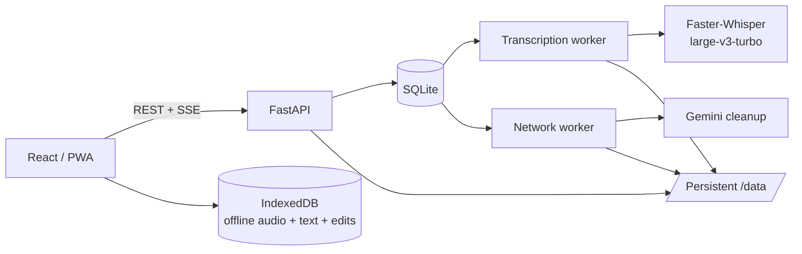

# Persian Auto Transcriber

A self-hosted Persian speech-to-text platform for long-form audio. Persian STT combines local CPU transcription with Faster-Whisper, optional Gemini-based text cleanup, synchronized subtitles, resumable background jobs, and a responsive React PWA for reviewing, editing, downloading, and keeping selected recordings available offline.

The project is designed primarily for a trusted local network. Whisper inference runs locally; network access is only required for optional Gemini cleanup.

## Highlights

- **Local Persian transcription** with `faster-whisper` and `large-v3-turbo`.
- **Long-audio processing** using resumable overlapping transcription windows.
- **Persistent queues and checkpoints** backed by SQLite and `/data` storage.
- **Cue-preserving cleanup**: Gemini may correct text and paragraph boundaries but cannot change cue IDs or timestamps.
- **Cleanup integrity verification** that detects missing, reordered, empty, or suspiciously truncated cleanup output.
- **Automatic cleanup repair** for incomplete published transcripts.
- **Manual Re-clean** from the normalized transcript without retranscribing the audio.
- **TXT, JSON, SRT, and VTT artifacts** for reading, debugging, playback, and export.
- **Multiple Gemini API keys** with encrypted storage, priority, cooldowns, local quota counters, and failure tracking.
- **Provider circuit breaker** to avoid hammering Gemini during outages or repeated rate-limit/server failures.
- **Range-based audio streaming** for normal browser seeking.
- **Responsive React frontend** with live REST/SSE updates.
- **Offline PWA library** using IndexedDB for complete audio, cleaned transcript data, and local edits.
- **Local subtitle editing** that never modifies backend transcription artifacts.
- **Edit-loop player mode** for repeatedly reviewing one subtitle cue while correcting it.

## Architecture



The API process does not perform Whisper inference. CPU-heavy transcription and network cleanup are isolated in separate workers so each resource class can be monitored, restarted, or limited independently.

## Processing pipeline

```text
Upload audio
    │
    ├─ FFprobe validation + source metadata
    │
    ▼
Transcription worker
    │
    ├─ overlapping audio windows
    ├─ Faster-Whisper inference
    ├─ checkpoint each completed window
    ├─ stable cue IDs + timestamps
    ▼
Normalized transcript
    │
    ├─ Hazm text normalization
    ▼
Network cleanup worker (optional)
    │
    ├─ split normalized cues into text-sized chunks
    ├─ Gemini receives cue ID + text only
    ├─ validate every returned cue
    ├─ checkpoint only validated chunks
    ├─ retry/retry-wait without skipping an unfinished chunk
    ├─ verify complete assembled output
    ▼
Published cleaned generation
    │
    ├─ readable TXT
    ├─ cleaned JSON
    ├─ SRT
    └─ VTT
```

Cue timing remains owned by the ASR stage. Cleanup can change text and `paragraph_after`, but it cannot merge, split, reorder, remove, add, or retime cues.

## Cleanup completeness and recovery

Cleanup is intentionally conservative. A Gemini HTTP success is not enough by itself: each chunk is validated before it can become a checkpoint.

The integrity layer checks:

- exact cue count and cue-ID order;
- duplicate, missing, or unexpected cue IDs;
- empty cleaned text;
- timestamp changes;
- suspicious chunk-sized shrink/expansion of cleaned text;
- presence of the complete cleaned artifact set.

The network worker runs an integrity sweep at startup and periodically while running. If an existing cleaned transcript is incomplete or suspicious, a cleanup repair task is queued from the normalized transcript. Existing published cleaned files stay available until the replacement generation passes validation.

Manual **Re-clean transcript** is stronger: it deliberately clears cleanup checkpoints and performs a fresh cleanup from the normalized transcript. It never reruns Whisper.

## Output artifacts

A completed job can expose:

| Artifact | Purpose |
| --- | --- |
| `raw_text` | Whisper-oriented raw text for inspection |
| `normalized_text` | normalized transcript text |
| `final_text` | cleaned, paragraph-aware reading text |
| `subtitle_raw_json` | raw timed cues |
| `subtitle_raw_srt` / `subtitle_raw_vtt` | raw subtitle exports |
| `subtitle_normalized_json` | canonical normalized timed cues used by cleanup |
| `subtitle_cleaned_json` | cleaned timed cues |
| `subtitle_cleaned_srt` / `subtitle_cleaned_vtt` | cleaned subtitle exports |

The browser player uses the timed JSON representation; the text reader prefers the final readable TXT.

## Repository layout

```text
.
├── app/
│   ├── api/                 # FastAPI routes
│   ├── core/                # events, runtime settings, security
│   ├── features/
│   │   ├── transcription/   # Faster-Whisper feature
│   │   └── cleaning/        # Gemini cleanup feature
│   ├── services/            # queues, storage, subtitles, tokens, verification
│   ├── workers/             # generic queue worker runner
│   ├── main.py
│   ├── models.py
│   └── schemas.py
├── frontend/                # React + TypeScript PWA
├── scripts/                 # smoke and pipeline helpers
├── tests/                   # backend unit/integration-oriented tests
├── Dockerfile
├── compose.yaml
├── pyproject.toml
├── README.md
├── BACKEND.md
└── FRONTEND.md
```

## Requirements

For the normal Docker deployment:

- Docker Engine + Docker Compose
- enough disk space for audio, checkpoints, model cache, and generated artifacts
- Faster-Whisper model available locally or model downloads enabled
- Gemini API key(s) only if cleanup is enabled

For direct development:

- Python `>=3.13,<3.14`
- `uv`
- FFmpeg / FFprobe
- Node.js `>=22.12` and npm for the frontend

## Quick start

Copy the environment template:

```bash
cp .env.example .env
```

At minimum, replace the application secret:

```env
APP_SECRET_KEY=replace-with-a-long-random-value
```

If the Whisper model is already available in the Hugging Face cache, mount its hub directory and prevent network model downloads:

```env
WHISPER_MODEL_CACHE=/home/your-user/.cache/huggingface/hub
WHISPER_LOCAL_FILES_ONLY=true
```

Otherwise:

```env
WHISPER_MODEL_CACHE=./models
WHISPER_LOCAL_FILES_ONLY=false
```

Start the application:

```bash
docker compose up -d --build
```

Then open:

```text
http://SERVER_IP:8000/
http://SERVER_IP:8000/docs
http://SERVER_IP:8000/api/health
```

The production frontend is a static Vite build and can be served by the same FastAPI process. The current deployment can build `frontend/` in a Node Docker stage and copy `frontend/dist` into the Python runtime image.

## Environment variables

Common bootstrap variables:

```env
COMPOSE_PROJECT_NAME=persian-stt-v2
APP_SECRET_KEY=replace-with-a-long-random-value
BOOTSTRAP_SOCKS5_PROXY=
LOG_LEVEL=INFO
API_BIND=0.0.0.0
BUILD_PROXY=
DATA_VOLUME_NAME=persian-stt-v2-data
WHISPER_MODEL_CACHE=./models
WHISPER_LOCAL_FILES_ONLY=false
```

Most algorithmic settings are runtime settings stored in SQLite and editable through the API/frontend rather than environment variables.

## Default runtime settings

Important defaults include:

```text
transcription.model                     large-v3-turbo
transcription.core_seconds              60
transcription.context_seconds           2
transcription.cpu_threads               4
transcription.beam_size                 5

cleaning.enabled                        true
cleaning.model                          gemini-3.5-flash-lite
cleaning.chunk_chars                    3500
cleaning.retry_count                    4
cleaning.retry_base_seconds             15
cleaning.request_timeout_seconds        120
cleaning.token_cooldown_seconds         300

worker.poll_seconds                     2
worker.max_attempts                     3
worker.retry_base_seconds               30
worker.stale_after_seconds              300

upload.max_bytes                        157286400
upload.max_duration_seconds             21600

circuit.gemini.failure_threshold        4
circuit.gemini.cooldown_seconds         300
```

Per-job transcription and cleaning settings are snapshotted so later global changes do not silently alter jobs that are already in progress. The network proxy remains live so routing can be changed while Gemini work is waiting/retrying.

## Worker model

The standard deployment uses three services:

```text
api             FastAPI + SQLite coordination + static frontend
transcriber     CPU-heavy Whisper queue
network-worker  Gemini cleanup + cleanup integrity verification
```

For a small home server, the transcriber can be CPU-limited independently in Compose, for example:

```yaml
services:
  transcriber:
    cpus: 1.5
```

This slows transcription but keeps the rest of the machine responsive and reduces sustained fan noise.

## Frontend

The frontend provides:

- upload and job controls;
- Files library with metadata, downloads, playback, and transcript access;
- synchronized Persian subtitle player;
- local cue editing with debounced IndexedDB persistence;
- optional edit-loop mode with a 300 ms pause between cue repetitions;
- standalone readable RTL transcript viewer;
- runtime settings and Gemini-key management;
- worker/system/circuit/token statistics;
- offline library for explicitly saved completed recordings;
- installable PWA behavior.

Offline copies include the **complete audio Blob**, audio metadata, cleaned cues/text, local cue edits, and an edited-text snapshot. Workbox is responsible only for the application shell/static assets; API responses and audio streams are not blindly runtime-cached.

See [FRONTEND.md](./FRONTEND.md) for implementation details.

## Backend/API

The backend exposes jobs, batches, files, artifacts, timed subtitles, runtime settings, encrypted API tokens, system state, circuit breakers, and SSE streams under `/api`.

Interactive API documentation is available at:

```text
http://SERVER_IP:8000/docs
```

See [BACKEND.md](./BACKEND.md) for the full architecture and endpoint guide.

## Persistence

The main persistent volume contains both the database and job files:

```text
/data/app.db
/data/jobs/<job-id>/source/
/data/jobs/<job-id>/work/transcription/chunks/
/data/jobs/<job-id>/work/cleaning/cues/
/data/jobs/<job-id>/artifacts/
```

Transcription and validated cleanup checkpoints survive worker/container restarts. On worker startup, interrupted tasks from the previous process are recovered so they can continue from existing checkpoints instead of waiting for a full stale-worker timeout.

## Testing

Run backend tests and deterministic checks:

```bash
./scripts/test_pipeline.sh
```

Against a running backend:

```bash
API_BASE_URL=http://SERVER_IP:8000 ./scripts/test_pipeline.sh
```

Optional live audio pipeline test:

```bash
uv run --group dev python scripts/live_job_test.py /path/to/test.mp3 \
  --base-url http://SERVER_IP:8000
```

Frontend checks:

```bash
cd frontend
npm install
npm run check
npm run build
```

## Security scope

The project is currently intended for a **trusted LAN**. There is no user authentication layer protecting file access, settings, or API-token management. Do not expose port `8000` directly to the public internet without adding authentication, authorization, HTTPS, and appropriate network controls.

Gemini API keys are encrypted at rest using `APP_SECRET_KEY`; keep this key stable and secret.

## Documentation

- [Backend architecture and API](./BACKEND.md)
- [Frontend architecture, PWA, offline storage, and player](./FRONTEND.md)
